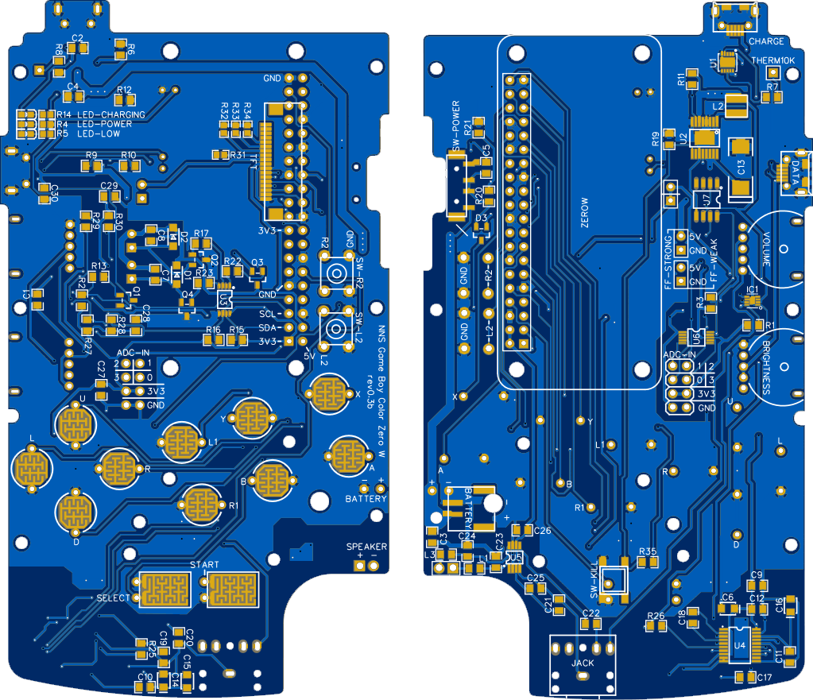
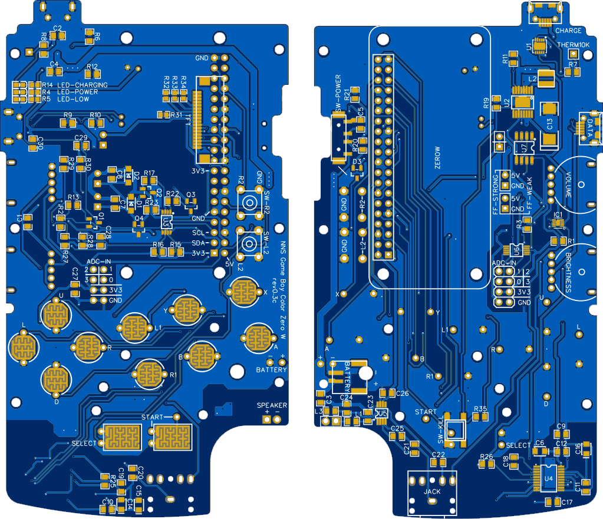
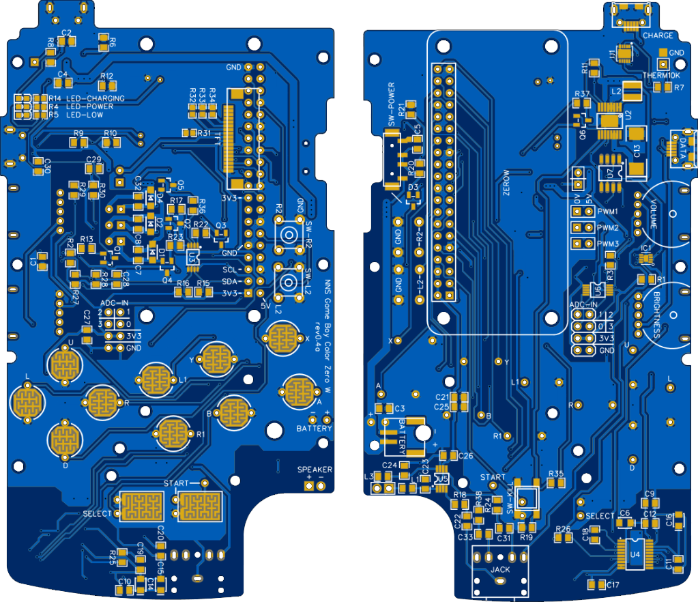
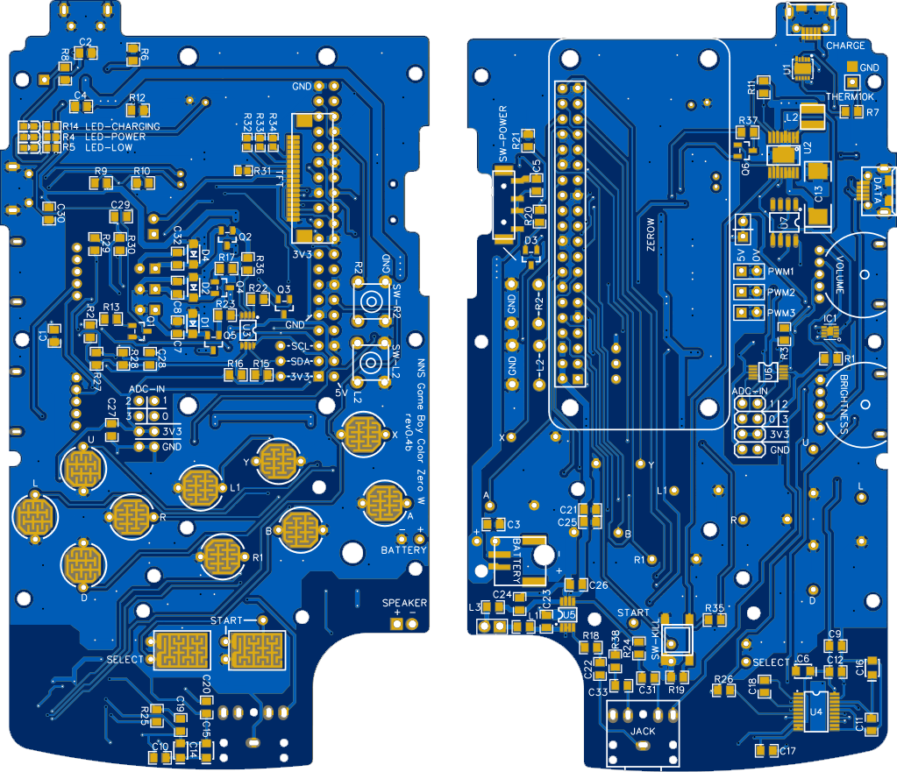
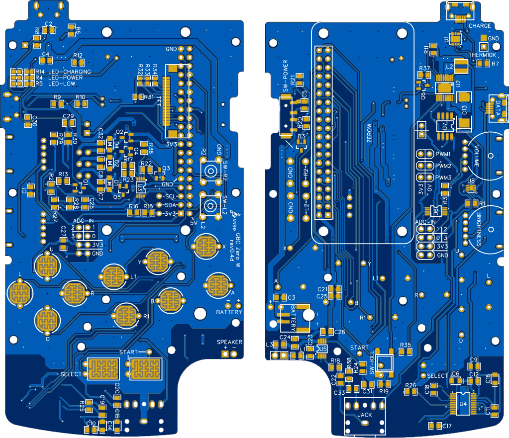
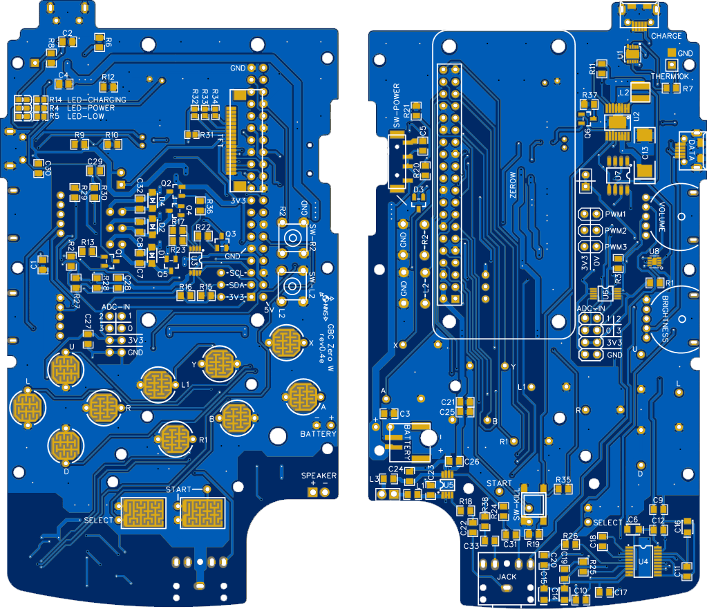
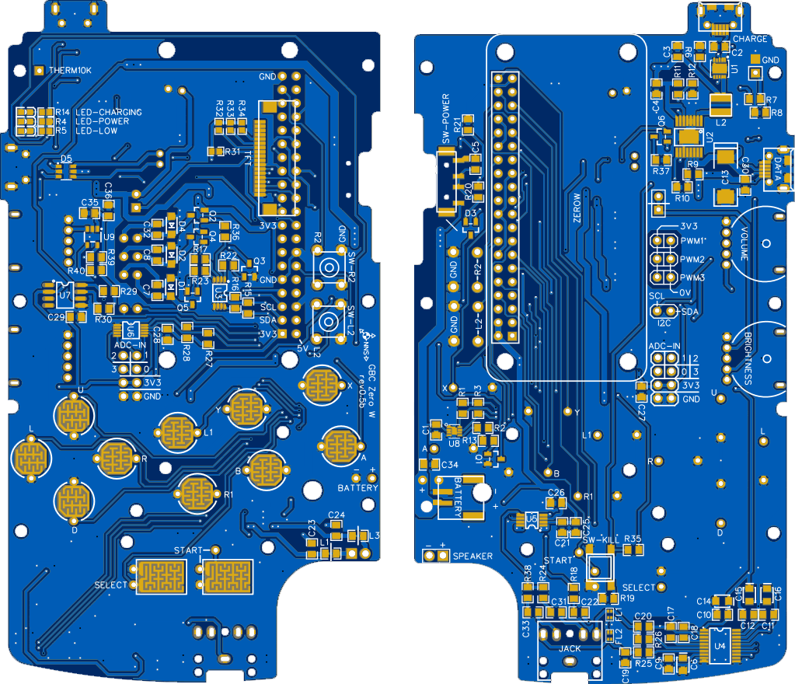

# NNS Game Boy Color Zero W : Solder Part

[Home](https://github.com/porcinus/NNS-Game-Boy-Color-Zero-W/)  

- 0.3a :  
  

- 0.3b :  
  

- 0.3c :  
  

- 0.4a :  
  

- 0.4b :  
  

- 0.4c :  
  

- 0.4d :  
  

- 0.4e :  
  

- 0.5a :  
  

- 0.5b :  
  

- 0.5c :  
  

