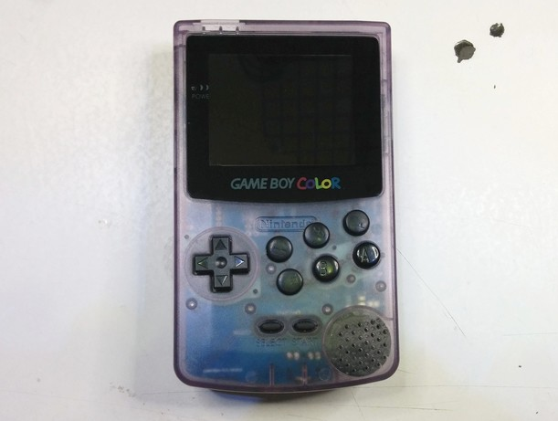

# NNS Game Boy Color Zero W Motherboard

The main idea behind this project was to create a motherboard that fit a Game Boy Color with less modifications as possible on the shell.  
It is based around a Raspberry Pi Zero W, sadly I don't have the needed equipment to debug troubles I could had have using a Compute Module.  

### Youtube :
  

### Preview :
  
More images can be found [HERE](Preview.md).  

### Some credits before start :
Thanks to [Freeplaytech team](https://www.freeplaytech.com/) and [Flavor](https://github.com/TheFlav/) for providing me some hints, especially about power slider / hotkey schematic.  
Rest of the schematics are based on manufacturers datasheets but some component values come from [Adafruit Learning System](https://learn.adafruit.com/) so thanks to Adafruit for keeping there products open source.  
A big wink to [Hipcat](https://www.youtube.com/user/jivinhipcat/) for sharing ideas, backlight potentiometer and other stuff along all his projects.  

### Important notes before start :
I made this project for the fun, I don't sell any kits so if you want to put your hands on it, you will have to order the board from a PCB manufacturer and the components from various supply company but also solder everything.  
I am not a electronic engineer, that mean that this PCB have some flaws, the noise management is far from perfect but at least, it work well.  
This project involve some soldering skills (0603,0805,DFN,TDFN,MSOP,VSSOP package) but using hot air could ease the job.  
It also require some modifications on existing OS image to get all the features working.  

### Features :
- **Raspberry Pi Zero W** obviously, **Not tested with non W version**.  
- **2.4inch ILI9341 18pin SPI screen** since it is widely available, cheap and acceptable quality.  
- **MCP73833T** Li-Ion/Li-Po charging IC, **TPS61030** boost converter for the 5V rail (avoid touching the PCB when it is running, this IC is highly sensitive to ESD), **MAX17048** fuel gauge to monitor battery voltage and percentage remain (used for low voltage system shutdown).  
- **MCP3221** ADC to control audio volume, **PCM5102A** I2S stereo DAC for audio output, **PAM8304** mono amplifier for the speaker and 2 common mode chokes to avoid ground loop.
- **PCA9633** PWM driver for display brightness (a potentiometer can be used for manual control), can also use the 3 remaining PWM output (prewired to a P-channel mosfet, a capacitor and a flyback diode).  
- On the input side : Dpad, A, B, X, Y, Start, Select, L1, R1, L2, R2, Hotkey on the power slider.  
- Analog inputs provided by **ADS1015** ADC IC, support upto 4 input (2 analog sticks).  
- **DS3231** for timekeeping, use main battery for backup.  

### Note :
- **Raspberry Pi Zero W** : The module need to be solder directly to the board (It is highly recommended to do the whole software part before).  
- **USB Data** : This connector can only be used for normal purpose, not charging. It require a micro USB to USB adapter. If this port is connected to a PC, the system will start but can't be turn off.  
- **TFT Screen** : Some modification can be done to black out the white case of the screen, a little modification on the ribbon cable is required.  
- **Glass lens** : Needed for fullscreen display since the display wider than the viewport, you will need to scratch excess of paint from the glass.  
- **Screen Backlight** : It can be controlled by software (**PCA9633**) **OR** using "**BRIGHTNESS**" potentiometer (require to cut a copper trace aside of Zero W board), **both cannot be used at the same time**.  
- **PWM** : 3V3 and 0V pins on theses outputs are stricly reserved for PWM use. Please note that logic is reverse to avoid devices connected to run full power during booting sequence.  
- **Force feedback** : All 3 PWM outputs can drive little motor but note that force feedback is supported by a very low number of emulators. This feature require use of a compatible driver.  
- **Volume** : Instead of using the common method by dimming the audio channels, the board use a ADC chip and a daemon to control ALSA audio volume. It is design that way to try to limit ground noise on the audio line.  
- **Speaker** : A pseudo stereo to mixing is done onboard but could introduce a bit of noises and distorsions. If this bother, you can remove R38 and C33, this will only leave right channel. You can then make a sofware mixing via asound config.  
- **Power Slider** : Use **XKB SK-1391L-1** (**C&K JSM08022SAQNL** as replacement) require no modification on the PCB but You can also use **DS Lite Power Switch** (**XKB SK-1391L-2** or **C&K JSM08022SAQNR** as replacement) by cutting showen trace and bridging the other one. Please note that the side of **SK-1391L-1**/**SK-1391L-2** switches **CAN'T** be solder, you will need to glue (just a tiny drop) to secure the switch on the PCB.  
- **Battery connector** : Please double check connector polarity. Major failure will occurs if battery is connected the wrong way. **NEVER** disconnect the battery when it is charging or system running.  
- **Kill switch** : Never press this switch will holding power slider on.  
- **Hotkey** : Select button is set by default on the provided image but you can also use the power switch.  
- **System setup need to be done thru WiFi**.  

### Note about soldering :
- Raspberry Pi Zero W should be solder at the very last moment, just **BEFORE** TFT FPC connector.  
- TFT FPC connector need to be solder last since it overlap Raspberry Pi Zero W solder points.  

### Documents :
- [Schematic](Schematic_last.pdf).  
- [BOM](BOM_last.pdf) : List of all needed components, see "Soldering guide" for additional informations about what is not needed.   
- [Gerber](Gerber_Motherboard_last.zip) : Lastest Gerber files revision.  
- [Soldering "guide"](SOLDER.md) : Pseudo guide to help the soldering process.  
- [Software guide](SOFTWARE.md) : Almost complet guide about image modifications needed, pre-modified image also available.  
- [Shell modifications guide](https://drive.google.com/file/d/1j6KHX8kt5VlsWwGDrVM5y6LKuopDRET4/view?usp=sharing) : Almost complet guide about shell modifications.  
  
- [PCB Preview](PCB_Preview.md) : Contain older and current motherboards PCB preview.
