# NNS Game Boy Color Zero W : Solder Part

### What to ignore on the BOM list
Depending on the features you want to use, not all the components are required to allow the device to run.  

Here is the list of components related to each features:  
- RTC : U7, R29, R30, C29  
- Analog inputs : U6, R27, R28, C27, C28  
- PWM outputs : R17, R23, R36, C7, C8, C32, D1, D2, D4, Q2, Q4, Q5  

### Polarized components
Some of this pictures has been taken during early stage of prototyping, traces may not be at the same place.  

- Diodes :  
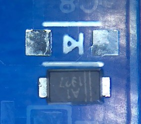  

- LEDs :  
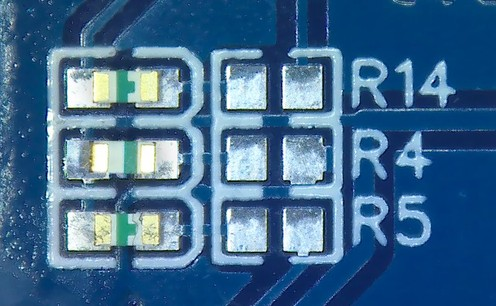  

  If you can, solder LEDs like this. It will allow you to see LEDs more once screen lens installed.  
  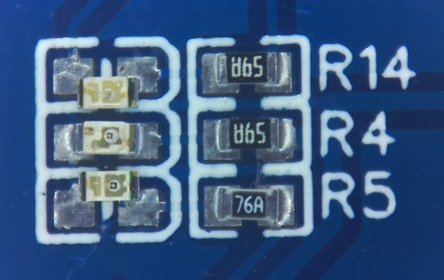  

### ICs
- U1 :  
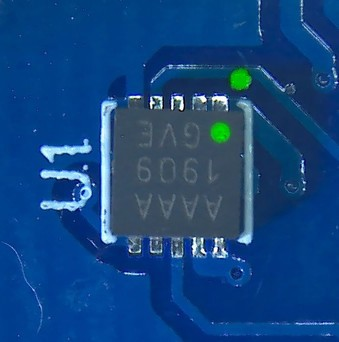  

- U2 :  
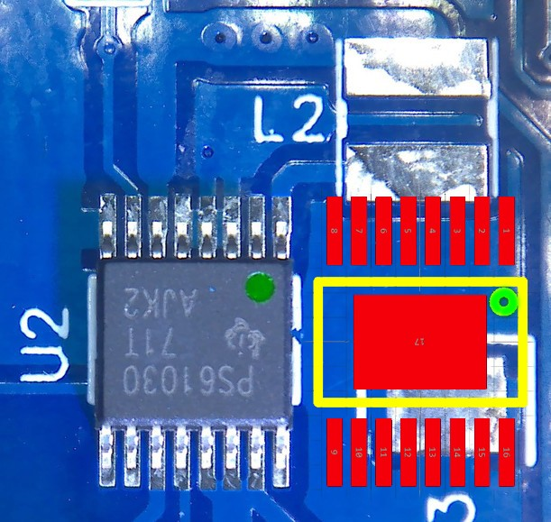  

- U3 :  
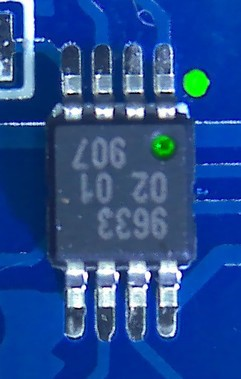  

- U4 :  
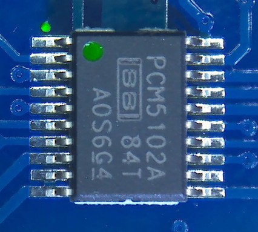  

- U5 :  
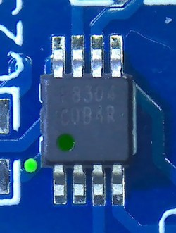  

- U6 :  
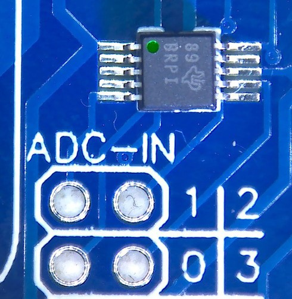  

- U7 :  
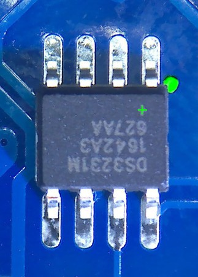  

- U8 :  
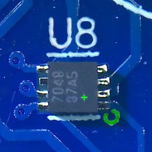  

### Power slider
If you are to use **DS Lite Power Switch** (**XKB SK-1391L-2** or **C&K JSM08022SAQNR**), you will have to cut a trace and make a bridge solder from a slider pin to a near capacitor.  
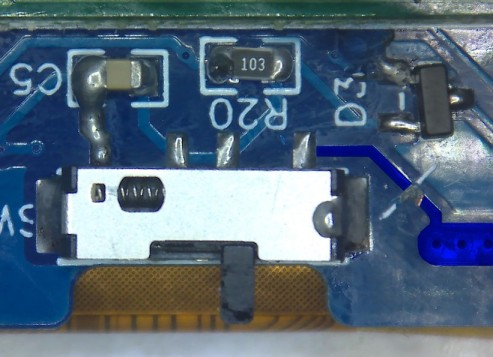  

### Zero W module
The green areas need to be solder "thru hole".  
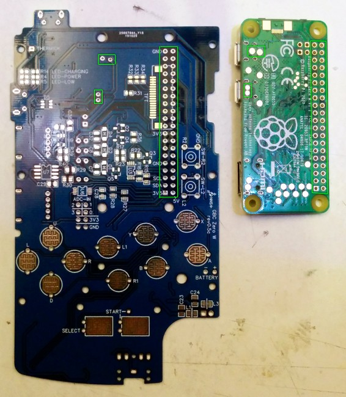  

